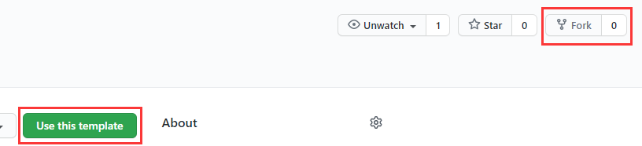
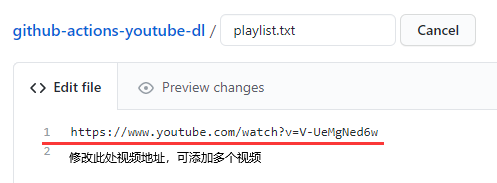
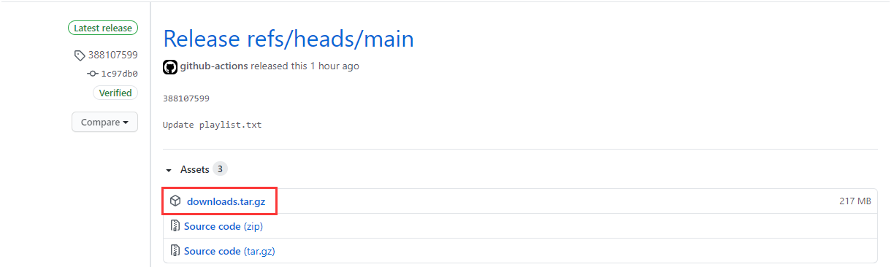

# Github-actions-youtube-dl 

Use GitHub Actions to download the highest-quality YouTube videos and automatically publish them to Release.

## Attention!

-**Github Release can release files up to 2G in size, please note that the size of your compressed package should not exceed 2G. **([Official document description](https://docs.github.com/cn/free-pro-team@latest/github/managing-large-files/distributing-large-binaries))

-**Please try to delete useless video files in Release after downloading **

-**✨Be kind to GitHub**

## Use

1. Fork this warehouse or Use this template.

2. After creating your own repository, enable GitHub Actions in Actions (Use this template is enabled by default).

3. *Change the content in config.txt as needed (non-essential steps, you can adjust the download parameters of youtube-dl here)*.
4. Fill in the URL of the YouTube video you want to download into **playlist.txt**, each line is limited to one video link, commit push submit.

5. After Actions runs automatically, all downloaded videos will be packaged into downloads.tar.gz and released to **Release**.
6. Enter Release and download the packed compressed file.

## License

[MIT](https://github.com/Heraldik/github-actions-youtube-dl/blob/main/LICENSE) © Heraldik

## Thanks

[justjavac](https://github.com/justjavac/github-actions-youtube-dl)
